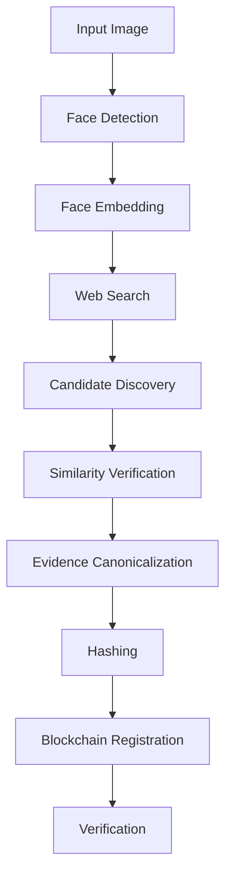

# Face Identification & Blockchain Verification

## Overview

This project implements a pipeline for face identification and blockchain verification. The system takes a face image as input and verifies its authenticity through a series of steps including face detection, embedding, web search, candidate discovery, similarity verification, evidence canonicalization, hashing, and blockchain registration.

## Architecture

## Modules

- `ui`: Terminal User Interface implementation using Ratatui and Crossterm
- `pipeline`: Core pipeline state machine
- `blockchain`: Blockchain integration
- `face`: Face recognition functionality
- `search`: Web search integration
- `config`: Configuration loading and management
- `error`: Error types for the application

## Getting Started

1. Install Rust
2. Clone the repository
3. Set up environment variables (see Configuration section)
4. Run `cargo build`
5. Run `cargo run`

## Configuration

Set the following environment variables:

- `BLOCKCHAIN_RPC_URL`: URL for the blockchain RPC
- `CONTRACT_ADDRESS`: Smart contract address
- `FACE_MODEL_PATH`: Path to the face recognition model
- `SEARCH_API_KEY`: API key for web search

## Development